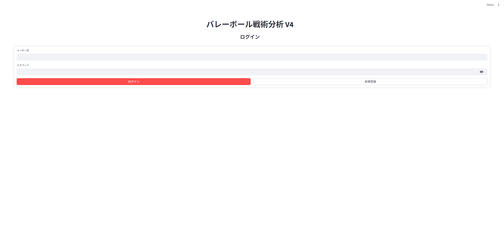
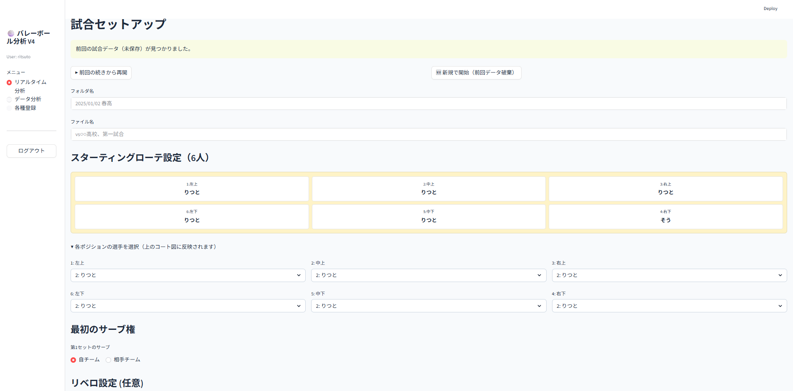
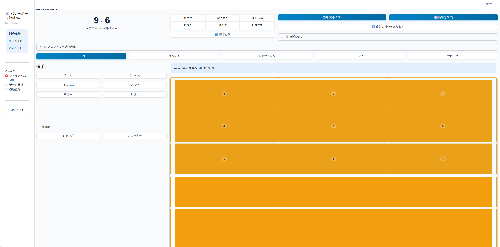
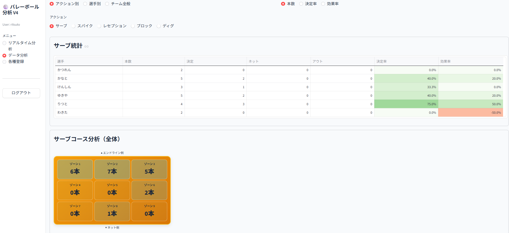

# 🏐 バレーボール戦術分析システム (Volleyball Analytics V4)

滋賀大学データサイエンス学部の自主ゼミで開発している、バレーボールの試合をリアルタイムで記録・分析するためのWebアプリケーションです。

## 🚀 概要
このアプリは、iPad等のタブレット端末を使って試合中のプレー（サーブ、レセプション、アタック等）を直感的に記録し、即座にチームの傾向を可視化することを目的としています。

## ✨ 主な機能
- **リアルタイム記録**: コート図をタップすることで、打点やコースを直感的に入力。
- **自動ローテーション管理**: 得点・失点に合わせてポジションが自動で回転し、リベロの交代も自動制御。
- **高度な分析機能**: 
  - コース別の決定率・効果率をヒートマップ形式で表示。
  - セッターの位置（S1〜S6）ごとのサイドアウト率・ブレイク率の算出。
  - 試合の得点推移グラフの自動生成。
- **クラウド保存**: Google Cloud Storageと連携し、ユーザーごとのデータを安全に永続化。

## 📸 アプリ画面イメージ

### 1. ログイン画面
セキュアなユーザー管理機能を備えています。


### 2. 試合セットアップ
スターティングメンバーやローテーション、リベロの設定を直感的に行えます。


### 3. リアルタイム分析
試合中のプレーをコート図タップで即座に記録。スコアやローテーションも自動連動します。


### 4. データ分析ダッシュボード
蓄積されたデータから、選手別統計やコース別の決定率を可視化します。


## 🛠 使用技術 (Tech Stack)
- **Language**: Python 3.10+
- **Frontend/App Framework**: [Streamlit](https://streamlit.io/)
- **Database/Cloud**: Google Cloud Storage (GCS)
- **Data Analysis**: Pandas, Matplotlib, UUID
- **Component**: カスタムSVGコートコンポーネント

### 技術詳細
## 🛠 インフラ・デプロイ詳細 (Infrastructure & Deployment)
本プロジェクトでは、スケーラビリティと環境の再現性を確保するため、以下の技術スタックを採用しています。

- **実行環境**: [Google App Engine (GAE)](https://cloud.google.com/appengine)
  - `app.yaml` により管理され、Python 3.9 ランタイム上で Streamlit を稼働させています。
- **コンテナ技術**: [Docker](https://www.docker.com/)
  - `python:3.12-slim` をベースイメージとした軽量なコンテナを構築。
  - `Dockerfile` にて依存ライブラリのインストールから実行コマンドまでを定義し、環境に依存しない動作を実現しています。
- **データ管理**: [Google Cloud Storage (GCS)](https://cloud.google.com/storage)
  - バケット名: `volley-app`
  - ユーザー情報 (`users.json`) や試合データをクラウド上に永続化し、複数端末からのアクセスに対応。
  - `google-cloud-storage` ライブラリを用いたカスタムヘルパー関数（アップロード/ダウンロード）を実装。

## 📂 ディレクトリ構成
- `volley_app.py`: アプリケーションのメインロジック
- `court_component/`: コート入力用のカスタムUIコンポーネント
- `data/`: 試合データおよび設定ファイルの保存先（.gitignoreにより保護）
- `app.yaml`: Google Cloud App Engineデプロイ用設定

## 🏃‍♂️ セットアップと実行手順 (Setup & Execution)
本アプリをローカル環境（自身のPC）で開発・実行するための手順です。

### 1. リポジトリのクローン
```bash
git clone [https://github.com/ritsuto-shiga/volleyball-app.git](https://github.com/ritsuto-shiga/volleyball-app.git)
cd volleyball-app
2. 仮想環境の構築と有効化
Bash
# 仮想環境の作成
python -m venv .venv

# 仮想環境の有効化 (Windowsの場合)
.venv\Scripts\activate

# 仮想環境の有効化 (Mac/Linuxの場合)
# source .venv/bin/activate
3. 依存ライブラリのインストール
Bash
pip install -r requirements.txt
4. アプリケーションの起動
Bash
streamlit run volley_app.py

## 👤 開発者
- 井上 立舜 (Ritsuto Inoue)
- 滋賀大学 データサイエンス学部 3年
- 河本研究室（次年度所属予定）
